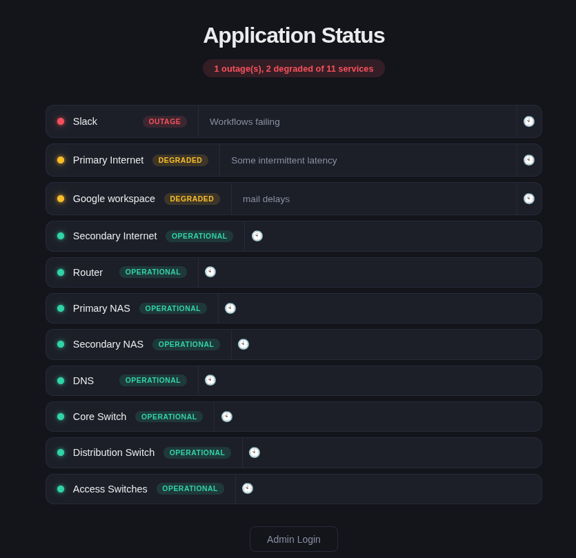

# status-my-page

> 🌐 Personal service status dashboard with 3-state health indicators, persistent history, mobile-responsive dark theme, and deploy scripts. View-only by default — admin login required to manage.

## ✨ Features

- **3-State Status System**: Click services to cycle 🟢 Operational → 🟡 Degraded → 🔴 Outage
- **Smart Notes**: Auto-show hidden notes only for degraded/outage states, auto-hide on green  
- **Status History**: Every toggle and notes update is timestamped — open the 🕙 history panel per service to see the full change timeline
- **Dark Theme UI**: Responsive layout (≤640px & ≤425px breakpoints), mobile-first CSS with proper touch targets
- **Admin Controls**: Session-based auth, drag-and-drop reorder, inline rename, add/delete items, auto-saving notes
- **Config-Driven**: `config.yaml` provides read-only provisioning input for services, credentials, and initial healthcheck definitions
- **Database Persistence**: SQLite (`instance/status.db`) is the single source of truth for all service items, statuses, notes, positions, and mutation history
- **Auto-Archival & Backups**: Pre-reset JSON snapshots (`archives/`) on restart, and atomic backup rotation (`.bak1`–`.bak5`) for `config.yaml` healthcheck edits
- **Input Sanitization**: Every user-supplied field is validated through a dedicated filter layer — blocks XSS payloads, SQL injection patterns, path traversal, shell metacharacters, and fuzzing attacks

## 📸 Preview



A dark-themed, mobile-responsive dashboard showing monitored services with colored status indicators (🟢 Operational, 🟡 Degraded, 🔴 Outage), per-service notes, and a summary pill at the top.

---

## 📋 Prerequisites

| Requirement        | Minimum Version     | Notes                                                  |
|--------------------|---------------------|--------------------------------------------------------|
| Python             | 3.10+               | Tested on 3.12–3.14 with CPython                       |
| pip                | Any recent version  | Used only for `requirements.txt` (flask, pyyaml)       |
| SQLite             | Bundled with Python | Database lives in `instance/status.db` (WAL mode auto) |
| Optional: gunicorn | 20+                 | Production WSGI server (used by `install.sh`)          |

**OS support:** Any Linux distro (Ubuntu, Debian, Fedora, RHEL, Arch, etc.) and macOS. The install script detects `apt`, `dnf`, or `yum` package managers automatically.

---

## 🚀 Installation

### Option 1: Local development

The quickest path — ideal for testing on your own machine or a VPS before production deploy.

```bash
# 1️⃣  Clone the repository
git clone https://github.com/notsimar/status-my-page.git
cd status-my-page

# 2️⃣  Create a virtual environment and install deps
python3 -m venv .venv
source .venv/bin/activate          # Windows: .venv\Scripts\activate
pip install -r requirements.txt     # installs flask + pyyaml

# 3️⃣  Generate a password hash
#    (NEVER store plaintext passwords in config.yaml or commit them to git)
python3 -c "from werkzeug.security import generate_password_hash; print(generate_password_hash('my-secure-pw'))"

# 📌 Copy the output — it looks like: scrypt$72816...
```

**Edit `config.yaml`** to list your services:

```yaml
items:
  - Primary Internet
  - Secondary Internet
  - Router
  - Primary NAS
  - Secondary NAS
  - DNS
  - Core Switch
  - Google workspace
  - Slack
  # ... add all the services you want to monitor

admin:
  user: admin                        # ← or override via STATUS_ADMIN_USER env var

server:
  host: "0.0.0.0"
  port: 8920
```

> **Note:** Do not put a plaintext password in `config.yaml`. The `STATUS_ADMIN_PASS_HASH` environment variable is **required** (no fallback). Generate one with the command below.

**Start the server:**

```bash
# Set your credentials via env vars, then run:
export STATUS_ADMIN_PASS_HASH="scrypt$72816$..."   # from step 3 above

./start.sh
```

The server launches on `http://localhost:8920`. Admin user is the value from `config.yaml` under `admin.user` (default: `admin`).

### Option 2: One-command production install (`install.sh`)

For a fresh Linux server (Ubuntu, Debian, Fedora, RHEL), the wizard handles everything:

```bash
# Clone into any directory (e.g. your home)
git clone https://github.com/notsimar/status-my-page.git ~/status-my-page
cd ~/status-my-page

# Run the install script as root — it will:
#   • Install python3, venv, gunicorn system packages
#   • Create a dedicated 'statuspage' system user
#   • Deploy files to /opt/status-page (default)
#   • Create Python venv + install dependencies
#   • Seed the SQLite database from config.yaml
#   • Prompt for admin credentials (stored in /etc/status-page/env, mode 0640)
#   • Install & enable a systemd service (status-page.service)
#   • Start Gunicorn on 127.0.0.1:8920 behind systemd
sudo ./install.sh
```

**Choose a custom install path:**

```bash
sudo ./install.sh /srv/status-dashboard
```

**What the wizard asks during installation:**

```
=== Setting admin credentials ===
Admin username [admin]: ?
Admin password: ?       ← typed silently, hashed as scrypt, stored in /etc/status-page/env

Credentials set: user=?

=== Installing systemd service (status-page.service) ===
Service enabled. Starting…

=== Verification ===
✅ status-page.service is running
✅ Status page responding (HTTP 200)

  Deployment complete!
  URL: http://<server-ip>:8920/
```

**After-install management:**

```bash
systemctl status status-page          # check if running
sudo systemctl restart status-page    # apply config changes
sudo journalctl -u status-page -f     # live logs
./cleanup.sh list                     # view archived snapshots
```

### Option 3: Manual systemd (no root / custom path)

If you can't or don't want to use `install.sh`, here's a manual example for **Ubuntu 22.04+**:

```bash
# Install system deps
sudo apt update && sudo apt install -y python3 python3-venv gunicorn

# Clone + setup the app
git clone https://github.com/notsimar/status-my-page.git /opt/status-page
cd /opt/status-page
python3 -m venv .venv
.venv/bin/pip install -r requirements.txt

# Create a service user (optional but recommended)
sudo useradd --system --no-create-home --shell /usr/sbin/nologin statuspage
sudo chown -R statuspage:statuspage /opt/status-page/{instance,logs,archives} 2>/dev/null || true

# Write credentials to env file
mkdir -p /etc/status-page
sudo tee /etc/status-page/env > /dev/null <<EOF
STATUS_ADMIN_PASS_HASH=scrypt$72816$...   # your hash here
STATUS_ADMIN_USER=admin
PYTHONUNBUFFERED=1
EOF
sudo chmod 0640 /etc/status-page/env

# Create systemd unit
sudo tee /etc/systemd/system/status-page.service > /dev/null <<'EOF'
[Unit]
Description=Status Page Web App
After=network.target

[Service]
Type=simple
User=statuspage
Group=statuspage
WorkingDirectory=/opt/status-page
ExecStart=/opt/status-page/.venv/bin/gunicorn \
    --bind 127.0.0.1:8920 \
    --workers 2 \
    --timeout 30 \
    app:app
Restart=on-failure
RestartSec=5
EnvironmentFile=/etc/status-page/env

[Install]
WantedBy=multi-user.target
EOF

# Enable and start
sudo systemctl daemon-reload
sudo systemctl enable --now status-page
sudo systemctl status status-page
```

### 🔁 Behind a reverse proxy (recommended for production)

The app binds to `127.0.0.1:8920` — put Nginx or Caddy in front to serve over HTTPS:

**Nginx example:**

```nginx
server {
    listen 443 ssl http2;
    server_name status.example.com;

    ssl_certificate     /etc/letsencrypt/live/status.example.com/fullchain.pem;
    ssl_certificate_key /etc/letsencrypt/live/status.example.com/privkey.pem;

    location / {
        proxy_pass http://127.0.0.1:8920;
        proxy_set_header Host $host;
        proxy_set_header X-Real-IP $remote_addr;
        proxy_set_header X-Forwarded-For $proxy_add_x_forwarded_for;
        proxy_set_header X-Forwarded-Proto $scheme;  # so Flask sets secure cookies
    }
}
```

**Caddy example (shorter):**

```caddy
status.example.com {
    reverse_proxy 127.0.0.1:8920
}
```

> **Important:** Make sure `X-Forwarded-Proto` is set so Flask knows the request is HTTPS — session cookies are marked `Secure` in that case.

---

## 📱 Status states at a glance

| State | Emoji | Notes behavior |
|-------|-------|----------------|
| Operational | 🟢 Green | Hidden automatically |
| Degraded | 🟡 Yellow | Visible — admin can add context notes |
| Outage | 🔴 Red | Always visible with pulsing red glow |

*Click any service as admin to cycle through states ♪*

## 🕙 Status History

Every mutation (status toggle, notes update) is recorded in a `status_history` SQLite table.

- **View**: Click the 🕙 clock icon on any service row → modal shows newest-first timeline
- **API**: `GET /api/history/<item_id>` — public read, no auth required
- **Format**: Entries include `event_type`, `old_value`, `new_value`, `occurred` (ISO-8601 UTC)

## 🔧 Configuration

### `config.yaml` structure

```yaml
items:
  - Primary Internet      # ← add your services here
  - Secondary Internet
  - Router
  - Primary NAS
  - Secondary NAS
  - DNS
  - Core Switch
  - Google workspace
  - Slack
  # Every restart, the DB is synced to this list

admin:
  user: admin       # ← can be overridden by STATUS_ADMIN_USER env var
  # Do NOT put plaintext passwords here — use STATUS_ADMIN_PASS_HASH instead

server:
  host: "0.0.0.0"
  port: 8920
  secret_key_env: STATUS_SECRET_KEY   # Flask session signing key
```

### Healthchecks (optional)

Automated per-service health checks update status indicators (🟢/🟡/🔴) in the background. Add a `healthchecks` section to `config.yaml`:

```yaml
healthchecks:
  Primary Internet:
    type: ping
    host: 1.1.1.1
    interval: 30
    timeout: 3
    retries: 2
  Database:
    type: tcp
    host: 192.168.10.50
    port: 5432
    interval: 60
    timeout: 5
    retries: 3
  API Gateway:
    type: curl
    url: https://api.example.com/health
    healthy_codes: [200, 204]
    interval: 30
    timeout: 10
    retries: 2
  Legacy SOAP Service:
    type: soap
    url: http://legacy:9000/soap
    soap_action: "HealthCheck"
    expected_string: "<Status>OK</Status>"
    interval: 60
    timeout: 15
  Google Workspace:
    type: rss
    url: https://www.google.com/appsstatus/dashboard/
    keywords:
      red: [outage, major issue]
      degraded: [degraded, minor, investigating]
    interval: 60
    timeout: 10
    retries: 2
```

**Healthcheck Types:**

| Type   | Required Keys | Optional Keys                                                                               | Use Case                                |
|--------|---------------|---------------------------------------------------------------------------------------------|-----------------------------------------|
| `ping` | `host`        | `interval`, `timeout`, `retries`                                                            | ICMP reachability (routers, hosts)      |
| `tcp`  | `host`, `port`| `interval`, `timeout`, `retries`                                                            | TCP port connectivity (DB, Redis, SMTP) |
| `curl` | `url`         | `healthy_codes`, `interval`, `timeout`, `retries`                                           | HTTP/HTTPS REST APIs                    |
| `soap` | `url`         | `soap_action`, `body`, `expected_string`, `healthy_codes`, `interval`, `timeout`, `retries` | SOAP/XML web services                   |
| `rss`  | `url`         | `keywords.red`, `keywords.degraded`, `interval`, `timeout`, `retries`                       | Vendor status pages (RSS/Atom feeds)    |

**Auto-detection:** If `type` is omitted, the parser infers it:
- `host` + `port` → `tcp`
- `host` only → `ping`
- `url` → `curl` (or `soap` if `soap_action`/`body` present)
- `rss` is never auto-detected — a bare `url` always means `curl`; set `type: rss` explicitly.

**RSS feed checks:** The worker fetches the feed (curl, stdlib XML parse,
first 20 entries, 512 KB cap) and scans entry titles/descriptions for
keywords. A matching `red` keyword flips the item red *immediately* (next
check, no retry ladder); a matching `degraded` keyword flips it degraded;
a clean feed flips it back to green. If the feed itself can't be fetched,
the normal retry ladder applies (degraded → red). `keywords` is optional:
with no keywords, only fetch failures change the status.

**Key Options:**
- `interval` — seconds between checks (default: 60)
- `timeout` — seconds per attempt (default: 10)
- `retries` — consecutive failures before marking degraded/red (default: 2)
- `healthy_codes` — HTTP codes considered healthy (default: `[200]`)
- `expected_string` / `body_contains` — response must contain this substring
- `keywords.red` / `keywords.degraded` — rss type: marker words per severity

### Environment variables

| Variable                 | Purpose                                             | Required | Example            |
|--------------------------|-----------------------------------------------------|----------|--------------------|
| `STATUS_ADMIN_USER`      | Override admin username from config.yaml            | No       | `john`             |
| `STATUS_ADMIN_PASS_HASH` | Password hash (**required** for production)         | **Yes**  | `scrypt$72816$...` |
| `STATUS_SECRET_KEY`      | Flask session signing key (auto-generated if unset) | No       | Any random string  |
| `STATUS_NO_ARCHIVE=1`    | Skip DB archival on restart (dev/testing only)      | No       | —                  |

**Generate a hash:**

```bash
python3 -c "from werkzeug.security import generate_password_hash; print(generate_password_hash('my-secure-pw'))"
```

### Database persistence & backups

The SQLite database (`instance/status.db`) is the single source of truth for all services, statuses, notes, positions, and history. `config.yaml` serves as a read-only input for provisioning new items and initial configuration.

When healthchecks are updated via the admin API:
1. Current `config.yaml` → `.bak1`
2. Existing backups shift up (`.bak1` → `.bak2` … → `.bak5`)
3. New config written atomically (`tempfile` + `os.replace`)

Backup files are excluded from git via `.gitignore`. You can recover:

```bash
# Restore from the most recent backup
cp config.yaml.bak1 config.yaml
./restart.sh
```

---

## 🛠 Scripts reference

| Script | Purpose | Example usage |
|--------|---------|---------------|
| `start.sh` | Launch dev server (PID tracking, logs → `logs/server.log`) | `./start.sh` |
| `stop.sh` | Graceful shutdown via PID file | `./stop.sh` |
| `restart.sh` | Kill + start without reinstalling deps | `./restart.sh` |
| `rebuild.sh` | Full dep install + DB migrations + restart | `./rebuild.sh` |
| `install.sh` | Production deploy wizard (systemd, user, gunicorn) | `sudo ./install.sh[/path]` |
| `cleanup.sh` | Archive manager for `archives/` JSON snapshots | See commands below |
| `scripts/backup.sh` | Database backup, restore, list, and pruning CLI wrapper | `./scripts/backup.sh -l` |
| `scripts/backup_db.py` | Python script for consistent SQLite backup API snapshots | `python3 scripts/backup_db.py` |
| `scripts/export_db.py` | Database export utility | `python3 scripts/export_db.py` |

### `cleanup.sh` commands

```bash
./cleanup.sh list                 # List all archive snapshots (newest first)
./cleanup.sh show 20260811_091523   # Pretty-print a specific snapshot
./cleanup.sh report               # Historical outage summary across archives
./cleanup.sh prune                # Keep last 2, delete the rest
./cleanup.sh prune --keep 10      # Keep last 10 snapshots instead
```

---


## 🧪 Testing & Quality Assurance

### Test Coverage Summary

| Test Suite                     | Coverage | Description                                                                                                                                        |
|--------------------------------|----------|----------------------------------------------------------------------------------------------------------------------------------------------------|
| `test_input_filter.py`         | **100%** | 95 assertions: XSS payloads, SQLi patterns, path traversal, shell injection, fuzzing, safe-string passthrough                                      |
| `test_healthcheck.py` | 84% | 91 tests: healthcheck parsing across all 5 types, endpoints, worker lock, exception paths (timeout, missing binaries, bad curl/ping/soap output) |
| `test_healthcheck_admin.py`    | —        | 82 tests: admin healthcheck CRUD + per-type validation (curl/ping/tcp/soap/rss), public feed toggle + endpoints                                    |
| `test_healthcheck_one_shot.py` | —        | One-shot `/api/healthcheck/run` flow for each type, incl. rss + worker restart                                                                     |
| `test_healthcheck_worker.py`   | —        | Worker thread lifecycle: E2E green→red→green, history rows, single-instance lock, hot restart                                                      |
| `test_rss_healthcheck.py`      | —        | 20 tests: rss runtime (red/degraded/green map, precedence, Atom, case-folding), edge cases (empty feed, entry cap, >512 KB body), prune regression |
| `test_rss_feed.py`             | —        | 26 tests: public `/feed.xml` output — well-formedness, escaping, guid/publish dates, enabled/disabled toggle                                       |
| `test_mc_dc.py`                | —        | **MC/DC formal verification** of app.py decisions D1, D2, D3 (security gate ×4 endpoints), D6 (CSRF internals), D7 (delete cleanup)                |
| `test_structural.py`           | —        | MC/DC for reorder override (D4) and set_notes YAML persist gate (D5)                                                                               |
| `test_history.py`              | —        | 13 end-to-end scenarios: history recording, public access, cascade delete, pruning                                                                 |
| `test_routes_and_features.py`  | —        | Auth, mutations, security headers, backups, admin credential validation                                                                            |
| `test_restart_persistence.py`  | —        | 2 critical restart-simulation tests (add/delete survival)                                                                                          |
| `test_healthcheck_mc_dc.py` | — | MC/DC for all 9 healthcheck decisions (D_hc1, D_hc2, D_hc3, D_hc5, D_hc7, and the rss family D_hc8–D_hc11) + worker lock — 50 tests |

**Overall coverage: 88%** (430 tests, measured 2026-08-18)

| Module | Coverage |
|--------|----------|
| `input_filter.py` | 100% |
| `statuspage/auth.py` | 97% |
| `statuspage/services.py` | 96% |
| `statuspage/rss.py` | 94% |
| `statuspage/db.py` | 93% |
| `statuspage/routes.py` | 91% |
| `healthcheck.py` (root worker) | 84% |
| `statuspage/config.py` | 86% |
| `app.py` (composition root) | 73% |
| **TOTAL (all modules)** | **88%** |

### Running Tests

```bash
# All tests (no server needed)
.venv/bin/pytest tests/ -v

# Specific test categories
.venv/bin/pytest tests/test_input_filter.py -v              # Input sanitization (100%)
.venv/bin/pytest tests/test_mc_dc.py -v                      # MC/DC structural proofs
.venv/bin/pytest tests/test_structural.py -v                 # Additional MC/DC (D4, D5)
.venv/bin/pytest tests/test_healthcheck.py -v                # Healthcheck + exception paths
.venv/bin/pytest tests/test_healthcheck_mc_dc.py -v          # Healthcheck MC/DC + worker lock
.venv/bin/pytest tests/test_history.py -v                    # Status history feature
.venv/bin/pytest tests/test_routes_and_features.py -v        # Auth, mutations, headers
.venv/bin/pytest tests/test_restart_persistence.py -v        # Restart simulation

# With coverage report
.venv/bin/pytest tests/ --cov=app --cov=healthcheck --cov=input_filter --cov-report=term-missing
```

### Structural Verification (MC/DC)

This project employs **Modified Condition/Decision Coverage** to prove that critical security guards, restoration filters, and healthcheck decision logic are logically sound.

- **Coverage Target**: Every condition in compound boolean expressions independently affects the outcome.
- **App Decisions (D1–D7)**: `test_mc_dc.py` — status/note restore filters (D1, D2), the 3-layer security guard (D3), CSRF internals (D6), delete cleanup cascade (D7); `test_structural.py` — reorder override (D4), notes YAML-persist gate (D5).
- **Healthcheck Decisions (D_hc1–D_hc11)**: `test_healthcheck_mc_dc.py` (50 tests) — curl result gate (D_hc1), URL sanitisation (D_hc2), type auto-detection chain (D_hc3), TCP validation (D_hc5), SOAP result gate (D_hc7), plus the rss decision family: response gate (D_hc8), keyword precedence (D_hc9), rss url parse guard (D_hc10), item/entry tag filter (D_hc11).
- **Documentation**: See [README_MCDC.md](./README_MCDC.md) for the full mapping table, and [docs/testing.md](./docs/testing.md) for the current per-decision counts and proof matrices.

```bash
# Run MC/DC structural coverage
.venv/bin/pytest tests/test_mc_dc.py tests/test_structural.py tests/test_healthcheck_mc_dc.py -v
```

The structural test suite uses fixture-based HTTP clients to simulate authenticated requests, then probes compound boolean expressions (auth guards, CSRF validation, rate-limiting thresholds, healthcheck result evaluation, URL sanitisation, rss feed gates, worker locking). Each assertion maps to a condition in the MC/DC proof matrix documented in [README_MCDC.md](./README_MCDC.md).

### Quick Health Check (Shell)

For CI pipelines or post-deploy validation:

```bash
# Requires running server on localhost:8920 (or set BASE_URL)
./tests/test_health.sh                    # Default: http://localhost:8920
./tests/test_health.sh http://myserver:9920  # Custom URL
```

This shell script validates: page load, static assets, auth-check, login, mutation auth requirement, 3-state toggle cycle, and notes API — all in ~2 seconds.

## 🗂 File structure

```
status-my-page/
├── config.yaml              # Read-only service definitions, admin creds, server cfg
├── input_filter.py          # Centralized input validation (XSS, SQLi, fuzzing sanitization)
├── app.py                   # Flask composition root & bootstrap
├── statuspage/              # Application package (db, services, routes, auth, healthcheck, rss)
├── scripts/
│   ├── backup.sh            # Backup/restore CLI wrapper
│   ├── backup_db.py         # Consistent SQLite snapshot & restore tool
│   └── export_db.py         # DB export script
├── cleanup.sh               # Archive manager: list / show / prune / report
├── requirements.txt         # flask, pyyaml
├── static/
│   ├── css/style.css        # Dark theme, 3 breakpoints (≤640px, ≤425px)
│   └── js/                  # Vanilla JS: app.js, healthchecks.js, rss.js
├── templates/index.html     # Jinja2-rendered UI with login & history modals
├── start.sh / stop.sh / restart.sh / rebuild.sh / install.sh
├── tests/
│   ├── conftest.py              # Shared fixtures (temp DB, admin auth, CSRF)
│   ├── test_input_filter.py     # 80+ assertions: XSS, SQLi, fuzzing, sanitization
│   ├── test_structural.py       # Reorder & notes DB mutations
│   ├── test_history.py          # Automated API/DB history test suite (13 scenarios)
│   ├── test_mc_dc.py            # MC/DC structural coverage
│   ├── test_healthcheck.py      # Healthcheck functional + 17 exception-path tests
│   ├── test_healthcheck_admin.py # Healthcheck Admin CRUD & validation
│   ├── test_healthcheck_mc_dc.py # Healthcheck MC/DC + worker lock
│   ├── test_routes_and_features.py # Auth, mutations, headers, backups
│   ├── test_restart_persistence.py # Restart simulation tests
│   ├── test_rss_feed.py         # RSS 2.0 public feed tests
│   ├── test_rss_healthcheck.py  # RSS healthcheck tests
│   └── test_health.sh           # Quick health-check script for CI/CD
├── License.md               # MIT © 2026 Simar Sahni
└── .venv/                   # (excluded from git/deploy)
```

## 🔒 Security checklist

| Feature                     | Implementation                                                                                                                                      |
|-----------------------------|-----------------------------------------------------------------------------------------------------------------------------------------------------|
| **Authentication**          | Flask signed sessions only — no plaintext cookie fallback; `STATUS_ADMIN_PASS_HASH` env var **required**                                            |
| **CSRF protection**         | Per-request secret token (header-only, no query param leakage), rotated on every successful mutation; 3-strike session wipe                         |
| **Login rate-limit**        | 5 failed attempts per IP → 30-second lockout                                                                                                        |
| **Mutation rate-limit**     | 60 mutations per IP per 60-second window                                                                                                            |
| **Password storage**        | werkzeug `scrypt` hashing with timing-safe HMAC comparison                                                                                          |
| **Input sanitization**      | Centralized `input_filter.py` layer — blocks XSS, SQLi, path traversal, shell injection, null bytes, and oversized payloads on every mutation route |
| **Content Security Policy** | `default-src 'self'`; inline CSS via `'unsafe-inline'` on style-src only                                                                            |
| **Additional headers**      | X-Content-Type-Options, X-Frame-Options=DENY, Referrer-Policy, Permissions-Policy                                                                   |

## 💻 API endpoints

| Route                                | Method   | Auth          | Action                                                       |
|--------------------------------------|----------|---------------|--------------------------------------------------------------|
| `/`                                  | `GET`    | Public        | Render full status page                                      |
| `/api/history/<id>`                  | `GET`    | Public        | Return change timeline for a service                         |
| `/feed.xml` (alias `/rss`)           | `GET`    | Public        | RSS 2.0 status-change feed                                   |
| `/api/rss`                           | `GET`    | Public        | Feed availability + metadata for the UI                      |
| `/api/healthchecks`                  | `GET`    | Public        | List configured healthchecks (read-only view)                |
| `/api/toggle/<id>`                   | `POST`   | 🔒 Admin+CSRF | Cycle: green → degraded → red                                |
| `/api/notes/<id>`                    | `POST`   | 🔒 Admin+CSRF | Save/update freeform note text                               |
| `/api/add`                           | `POST`   | 🔒 Admin+CSRF | Create new service item                                      |
| `/api/delete/<id>`                   | `POST`   | 🔒 Admin+CSRF | Remove service + compact positions + prune history           |
| `/api/rename/<id>`                   | `POST`   | 🔒 Admin+CSRF | Update service display name                                  |
| `/api/reorder`                       | `POST`   | 🔒 Admin+CSRF | Apply drag-drop position map                                 |
| `/api/healthcheck/run`               | `POST`   | 🔒 Admin+CSRF | One-shot healthcheck run for a service (immediate result)    |
| `/api/healthchecks`                  | `POST`   | 🔒 Admin+CSRF | Register a healthcheck (curl/ping/tcp/soap/rss)              |
| `/api/healthchecks/<name>`           | `PUT`    | 🔒 Admin+CSRF | Update a healthcheck (partial body), hot-restarts the worker |
| `/api/healthchecks/<name>`           | `DELETE` | 🔒 Admin+CSRF | Remove a healthcheck                                         |
| `/api/rss`                           | `POST`   | 🔒 Admin+CSRF | Toggle the public status feed on/off                         |
| `/api/csrf-token`                    | `GET`    | 🔒 Admin      | Fetch fresh CSRF token                                       |
| `/login` / `/logout` / `/auth-check` | —        | Public        | Session management                                           |

### Quick curl examples

```bash
# View history for service id=1 (no auth needed)
curl http://localhost:8920/api/history/1 | jq

# Login to get a session cookie, then toggle status
TOKEN=$(curl -s http://localhost:8920 | grep -o 'csrf_token[^"]*"[^"]*"' | head -1 | awk -F'"' '{print $4}')
curl -b cookies.json -s -X POST http://localhost:8920/login \
  -d '{"user":"admin","pass":"your-password"}'

# Toggle service #1
export CSRF_TOKEN=...   # from page or /api/csrf-tokencurl -X POST http://localhost:8920/api/toggle/1 \
  -H "X-CSRF-Token: $CSRF_TOKEN"
```

## 📜 License

MIT License. Copyright © 2026 Simar Sahni ([@notsimar](https://github.com/notsimar)). See [License.md](./License.md).
